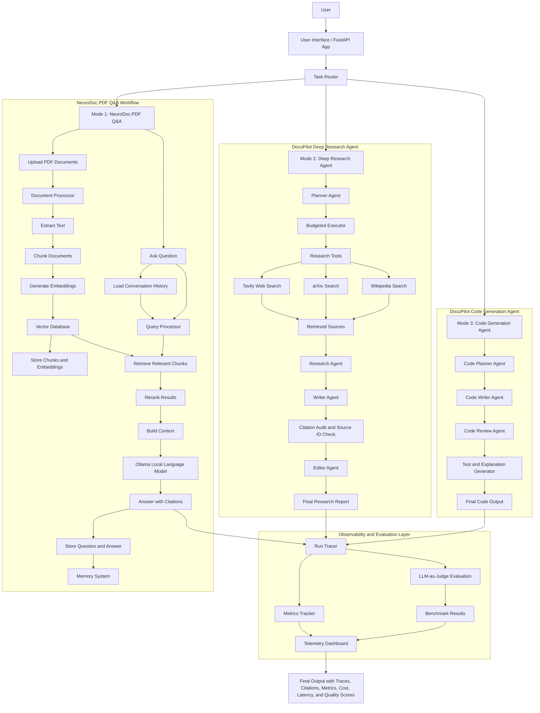
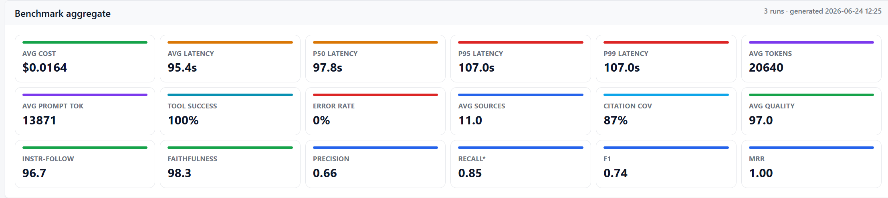

# Multi-Agent Research Pipeline — with Live Observability & Benchmarking

A reflective multi-agent research system (FastAPI + [aisuite]/OpenAI). A **planner**
breaks a query into steps; **research / writer / editor** agents execute them using
**Tavily (web)**, **arXiv** and **Wikipedia** tools. Every LLM and tool call is traced,
scored by an **LLM-as-judge**, and aggregated into a **benchmark**.

## Architecture



## Architecture Overview

DocuPilot AI combines the NeuroDoc PDF Q&A foundation with a newer multi-agent research and code-generation pipeline.

The PDF Q&A workflow handles PDF upload, text extraction, document chunking, embedding generation, vector storage, hybrid retrieval, reranking, context construction, local LLM answering through Ollama, citation generation, and conversation memory.

The deep research workflow uses a planner agent to break a query into steps, a budgeted executor to manage context, research tools such as Tavily, arXiv, and Wikipedia, and research/writer/editor agents to produce a grounded final report with citation auditing.

The code-generation workflow uses planner, writer, reviewer, and test/explanation agents to generate code outputs.

All three workflows share the same observability layer, which tracks traces, token usage, cost, latency, tool calls, errors, benchmark results, citation coverage, retrieval metrics, and LLM-as-judge quality scores.


## Quick start

```powershell
cd multi_agent
Copy-Item .env.example .env      # then put OPENAI_API_KEY and TAVILY_API_KEY in .env
.\venv\Scripts\python.exe main.py
```

- App / live runner: http://127.0.0.1:8000
- Telemetry + benchmark dashboard: http://127.0.0.1:8000/dashboard

## What gets measured (per run)

Saved to `runs/trace_*.json` (machine) and `runs/trace_*.txt` (human), plus a
dynamic architecture image `runs/arch_*.png`.

| Group | Metrics |
|---|---|
| Cost & latency | cost (USD), wall time, per-step LLM/tool latency, P95 (benchmark) |
| Tokens | prompt / completion / total tokens (per call and per run) |
| Tool use | tool calls, **tool success rate**, **tool error rate**, per-tool latency |
| Retrieval (RAG) | sources retrieved, **precision**, **recall\***, **F1**, **MRR**, **Hit@k** |
| Citations | sources cited, **citation coverage**, inline citation markers |
| Report quality | relevance, coherence, coverage, citation accuracy, **faithfulness**, **instruction-following**, overall (0–100) + grade + "where it went wrong" |
| Run | `run_id`, status, steps, error rate |

\* recall is an **LLM coverage proxy** — there is no labelled ground-truth set of
"all relevant documents", so exact recall is not computable. See *Adding ground truth* below.

## Why the error count can read 0 (and how errors are actually checked)

Tools like Tavily/arXiv/Wikipedia **do not raise** on failure — they return an error
*payload*, e.g. `[{"error": "arXiv API request failed ..."}]`. A naive counter that only
catches exceptions therefore reports **0 errors** even when a tool failed.

This project measures both:

- **`errors_raised`** — exceptions thrown by an LLM/tool call (hard failures).
- **`tool_result_errors` / `tool_error_rate`** — tool calls whose *result* was an error
  payload. `Tracer._tool_failed()` inspects every tool result, so the dashboard shows the
  real tool success rate (e.g. arXiv unreachable → tool success 50%, not 100%).

## LLM-as-judge

After each run, `src/evaluation.py` runs two judges (model: `gpt-4.1-mini`, temperature 0):

- `judge_report` — scores the final report 0–100 on relevance, coherence, coverage,
  citation accuracy, factual grounding (faithfulness) and instruction-following, and writes
  a concrete **"where it went wrong"** critique.
- `judge_retrieval` — labels each retrieved source relevant / not relevant → **precision**,
  a **coverage-proxy recall**, **F1**, **MRR** and **Hit@k**.

Evaluation is best-effort; if a judge call fails the run still completes. Disable with
`EVAL_ENABLED=0`.

## Benchmark

```powershell
.\venv\Scripts\python.exe scripts\benchmark.py 10     # 1..14 prompts
```

Writes `benchmark/benchmark_results.json`, `benchmark/RESULTS.md`, and updates the section
below in this README. The dashboard reads the same JSON.

## Benchmark results



_Full dashboard screenshot: [benchmark/dashboard.png](benchmark/dashboard.png) · live at `/dashboard`._

<!-- BENCHMARK:START -->
_Last run: 2026-06-24 12:25 · 3 research queries · judge = gpt-4.1-mini_

| Metric | Value |
|---|---|
| Average cost (USD) | $0.0164 |
| Average latency | 95.4 s |
| P50 latency | 97.8 s |
| P95 latency | 107.0 s |
| P99 latency | 107.0 s |
| Average total tokens | 20640 |
| Average prompt tokens | 13871 |
| Tool success rate | 100% |
| Error rate | 0% |
| Average sources retrieved | 11.0 |
| Average citation coverage | 87% |
| Retrieval precision (LLM-judged) | 0.66 |
| Retrieval recall (coverage proxy) | 0.85 |
| Retrieval F1 | 0.74 |
| Retrieval MRR | 1.00 |
| Report quality (0-100) | 97.0 |
| Instruction following (0-100) | 96.7 |
| Faithfulness (0-100) | 98.3 |

### Per-run

| # | Query | Tokens | Cost $ | Latency s | Tool ok | Src | Cite cov | Quality | Prec | Rec* | F1 |
|---|---|---|---|---|---|---|---|---|---|---|---|
| 1 | Retrieval-augmented generation for enterprise se | 19794 | 0.0161 | 97.8 | 100% | 12 | 100% | 97 | 0.75 | 0.90 | 0.82 |
| 2 | Vector database indexing methods (HNSW vs IVF-PQ | 17080 | 0.0140 | 81.5 | 100% | 8 | 100% | 97 | 0.62 | 0.80 | 0.70 |
| 3 | Mixture-of-Experts large language models: routin | 25047 | 0.0191 | 107.0 | 100% | 13 | 62% | 97 | 0.62 | 0.85 | 0.71 |

\* recall is an LLM coverage proxy (no labelled ground-truth set).
<!-- BENCHMARK:END -->

## How this maps to the industry metrics framework

This is an **orchestration / RAG-agent** system, not a model-training pipeline, so the
training-stage metrics in the reference framework are not applicable here.

| Framework area | Status here |
|---|---|
| RAG: retrieval Hit@k / MRR / recall@k | **Implemented** (LLM-judged) |
| RAG: faithfulness / answer relevance / context precision | **Implemented** (judge) |
| RAG: hallucination / citation accuracy | **Implemented** (citation coverage + judge) |
| Agent: task success rate, steps, token budget | **Implemented** (status, steps, tokens) |
| Agent: tool-call success / error | **Implemented** (real tool error detection) |
| Agent: instruction following | **Implemented** (judge) |
| Cost & latency: $/task, P95, per-step latency | **Implemented** |
| Pre-training loss / perplexity / gradient norm | N/A (no training here) |
| SFT/RLHF: MMLU, HumanEval, reward model, KL | N/A (model-level benchmarks, not orchestration) |

### Adding labelled ground truth (for exact precision/recall)

Provide, per query, a set of known-relevant URLs. Then precision = relevant∩retrieved /
retrieved and recall = relevant∩retrieved / relevant. Wire this into
`src/evaluation.py::judge_retrieval` to replace the LLM proxy.

## Performance & cost tuning

A round of optimizations cut cost/latency/tokens and — most importantly — raised citation
coverage and faithfulness. _Before_ = original pipeline (10-query baseline);
_After_ = optimized pipeline (same queries).

| Metric | Before | After | Change |
|---|---|---|---|
| Avg cost / query | $0.032 | $0.016 | −49% |
| Avg latency | 170 s | 95 s | −44% |
| P50 / P95 latency | – / 228 s | 98 s / 107 s | tighter tail |
| Avg prompt tokens | 22,513 | 13,871 | −38% (−58% vs first run of 32,679) |
| Avg sources retrieved | 18.3 | 11 | leaner |
| Citation coverage | 3% | **87%** | +84 pts |
| Faithfulness (0–100) | 81 | 98 | +17 |
| Report quality (0–100) | 88 | 97 | +9 |
| Instruction following | 89 | 97 | +8 |

Levers applied:
- **Correct cost**: cached prompt tokens billed at the cached rate (~25% of input) in `estimate_cost`.
- **Faster planner** (`gpt-4.1-mini`, was `o4-mini`). The editor stays `gpt-4.1-mini` — `gpt-4.1-nano`
  corrupted arXiv IDs and dropped citation coverage to 0%.
- **Leaner plans** (max 5 steps) and **capped retrieval** (Tavily 4, arXiv 3) → fewer sources/tokens.
- **Search cache**: a per-process cache dedupes repeated Tavily/arXiv/Wikipedia queries.
- **Budgeted executor context**: each prior step is capped and only recent steps are kept within a
  character budget, instead of re-sending every step's full output to every later step.
- **Strict citation prompting** plus an explicit numbered list of the *actual retrieved sources*
  injected into the writer/editor so they cite real URLs by `[n]` — this drove citation 3% → 87%.
- Models are env-configurable: `PLANNER_MODEL`, `RESEARCH_MODEL`, `WRITER_MODEL`, `EDITOR_MODEL`.

Not implemented: a true cross-encoder re-ranker (no offline model available) and intra-turn parallel
tool calls (aisuite executes tool calls sequentially); the search cache + retrieval caps deliver the
latency benefit instead.

## Project layout

```
main.py                 FastAPI app + endpoints (/dashboard, /runs, /benchmark, /task_*)
src/planning_agent.py   planner + executor (token-budgeted context, agent routing)
src/agent.py            research / writer / editor agents
src/research_tools.py   tavily / arxiv / wikipedia tools
src/trace_logger.py     Tracer: telemetry, sources, citations, tool-error detection, metrics
src/evaluation.py       LLM-as-judge: report quality + retrieval precision/recall/F1/MRR
src/run_diagram.py      dynamic per-run architecture PNG
scripts/benchmark.py    multi-run benchmark + README updater
templates/index.html    live run UI
templates/dashboard.html telemetry + benchmark dashboard
runs/                   per-run trace_*.json/.txt + arch_*.png
benchmark/              benchmark_results.json + RESULTS.md
```
